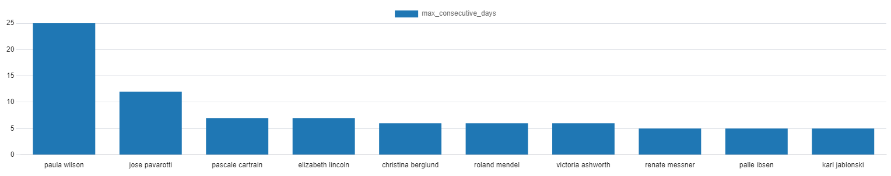

## Business Requirement Definition:
 ### Stakeholder Story:
Northwind is an international imports and exports company specializing in food products. We operate as a B2B entity, sourcing food items from various suppliers worldwide and distributing them to food providers across different countries. Our business model involves dealing with multiple suppliers, each providing distinct products, which are then distributed to customers across various categories such as beverages, condiments, confections, dairy products, grains/cereals, meat/poultry, and seafood.

We meticulously track customer demographics and their corresponding contacts, as well as supplier information and their respective contacts. Our products have unit prices, which may undergo periodic adjustments. We monitor our stock levels and set reorder thresholds to replenish products from suppliers when necessary. Not all products are available for inclusion in our product list for customers.

Orders from customers are fulfilled by shipping them in containers via sea freight to the customer's location. We engage with various shipping companies to facilitate this transportation process and track relevant shipper data including names and contact information. Each order is detailed, specifying product quantities, discounts, unit prices, and freight fees.

Our employees are assigned to different territories and handle specific customer orders until completion. As a company, we aim to implement a system that tracks our sales orders, analyzes our business performance, and provides insights into our gross sales, customer behavior, and employee performance. We seek to understand customer behavior to minimize churn rates, monitor gross sales and quantities over time, and identify top-selling products and profitable customers on a daily, weekly, monthly, quarterly, and yearly basis.

Our database operations are currently managed using PostgreSQL, and we intend to build our system on-premises within our company's data center. We require user-friendly dashboards for easy interpretation of data and insights. Our budget constraints suggest leveraging open-source technologies like PostgreSQL and other open-source tools for implementing the data warehouse.

 ### Source System understanding:
  ..
  1. **Physical Schema:**
  2. **Tables Description and Structure:**
  

### Functional Requirements:

1. **Data Integration:**
   - The data warehouse system must seamlessly integrate data from operational sources including tables for suppliers, customers, products, orders, and employees. This integration should ensure that all relevant data is consolidated and readily accessible for analysis.

2. **Daily Order Management Updates:**
   - The system should provide real-time or daily updates on order management activities, including sales figures and customer interactions. This feature enables timely decision-making and allows for a proactive approach to managing customer relationships.

3. **User-friendly Dashboards:**
   - User-friendly dashboards must be developed to visualize sales performance, customer behavior, and employee performance. These dashboards should offer comprehensive insights on a daily, weekly, monthly, quarterly, and yearly basis, enabling stakeholders to track trends and make informed decisions.

4. **Calculation and Display of Metrics:**
   - The system should accurately calculate and display metrics such as gross sales, quantities sold, and profits for each product and customer over time. This functionality provides stakeholders with a clear understanding of the financial performance of specific products and customer segments.

5. **Employee Assignment Tracking:**
   - The system must support employee assignments and track their interactions with customers and orders. This feature ensures accountability and allows for the monitoring of employee performance in managing customer relationships and fulfilling orders.

### Non-Functional Requirements:

1. **Quick Response Times:**
   - The system should prioritize quick response times for data retrieval and analysis to ensure efficient decision-making. This requirement is essential for maintaining productivity and responsiveness in a dynamic business environment.

2. **Scalability:**
   - The data warehouse solution should be scalable to accommodate future growth in data volume and user requirements. This scalability ensures that the system can effectively handle increased data loads and user interactions without compromising performance.

3. **Reliability:**
   - The system must be highly reliable, ensuring data integrity and minimal downtime for business operations. This reliability is crucial for maintaining trust in the accuracy and availability of data for decision-making processes.

4. **Security Measures:**
   - Robust security measures must be implemented to protect sensitive business data from unauthorized access or breaches. This includes features such as access controls, encryption, and data masking to safeguard against potential threats.

5. **Usability:**
   - User interfaces should prioritize usability, ensuring that stakeholders can access and interpret data without extensive training. Intuitive navigation and clear presentation of information facilitate user adoption and enhance the effectiveness of the system.

6. **Flexibility:**
   - The system architecture should be flexible to accommodate changes in business processes, such as the introduction of new product categories or supplier relationships. This flexibility ensures that the system can adapt to evolving business requirements and support ongoing growth and innovation.
## Technical Architecture Design:
..
 
  1. **Infrastructure:**
  2. **ELT Process:**
  3. **Capture Data Change:**
  4. **Medallion Architecture:**
  5. **Dashboard Layer:**

## Dimensional Modeling:
  * Identify the business process:
  * Declare the grain of the business process:
  * Identify the dimensions:
  * Identify the facts:
  ### Physical Design:
  ### ETL Design and Development:
## BI Application Design:

## Title: Customers Dashboard

### Business Insights:
- Key Performance Indicators (KPIs):
  - Total Sales
  - Number of Customers
  - Number of Orders

After analyzing this data and customer behavior, we discovered several insights that our client may find valuable. Here are the main ones:

### Dashboard Insights:
1. **Top Customers by Sales** (Type: Bar Chart)
2. **Sales by Country** (Type: Map)
3. **Sales for the Top Customer by Year and Quarter** (Type: Line Chart)
4. **Number of Customers per Segment** (Type: Funnel)

We also include a slicer to filter the dashboard according to the year and quarter.

#### Question 1  
  - Showing the Total_sales per customer
  
  
---

#### Question 2
- Showing the total_sales per product
  
  
---

#### Question 3 
  - Showing the max_consecutive_days for the customer
  
  

---

#### Question 4 
  - Showing the top city with sales
  
  
---

#### Question 5 
  - Showing the top country with sales
  
  
---

#### Question 6  
  - Showing the price deviation
  
  
---

#### Question 7  
  - Showing the top categories with sales
  
  
---

#### Question 8  
  - Recency, Frequency, Monetary Value (RFM) and customers segmentation  
  

---

#### Question 9  
  - Showing the top city and country customers by sales  
  
  
---

#### Question 10  
  - Showing the top shipper  
  
  

---

#### Question 11  
  - Showing the top supplier  
  
  

---

#### Question 12  
  - Showing the countries of top 50 percentage sharing in sales  
  
  

---

#### Question 13  
  - Showing the customers of top 50 percentage sharing in sales  
  
  

---

#### Question 14  
  - Showing the employees of top 50 percentage sharing in sales  
  
  

---

#### Question 15  
  - Showing the sales of employees  
  
  

---

#### Question 16  
  - Showing the count_of_employees_under_supervision_manager  
  

---

#### Question 17  
  - Showing the trend analysis by months sales  
  
  

---

#### Question 18  
  - Showing the quarter sales  
  
  

---

#### Question 19
  - Showing the days sales  
  
  

---

#### Question 20
  - Showing the top 20 dates by sales  
  
  

