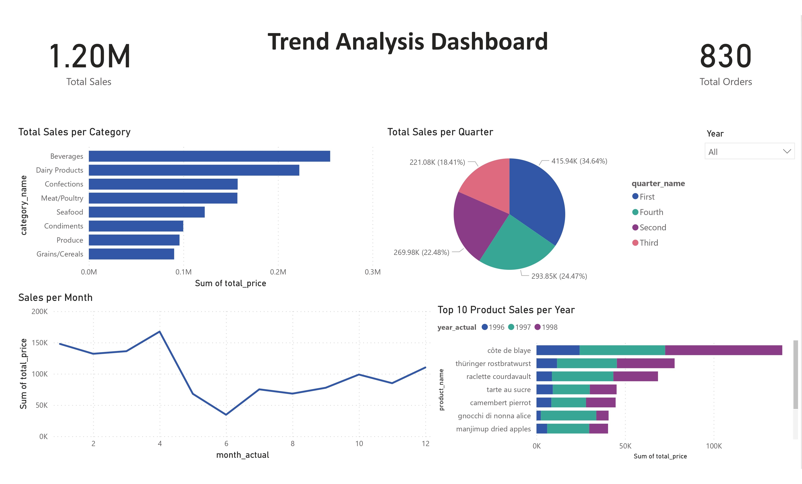

## Business Requirement Definition:
 ### Stakeholder Story:
Northwind is an international imports and exports company specializing in food products. We operate as a B2B entity, sourcing food items from various suppliers worldwide and distributing them to food providers across different countries. Our business model involves dealing with multiple suppliers, each providing distinct products, which are then distributed to customers across various categories such as beverages, condiments, confections, dairy products, grains/cereals, meat/poultry, and seafood.

We meticulously track customer demographics and their corresponding contacts, as well as supplier information and their respective contacts. Our products have unit prices, which may undergo periodic adjustments. We monitor our stock levels and set reorder thresholds to replenish products from suppliers when necessary. Not all products are available for inclusion in our product list for customers.

Orders from customers are fulfilled by shipping them in containers via sea freight to the customer's location. We engage with various shipping companies to facilitate this transportation process and track relevant shipper data including names and contact information. Each order is detailed, specifying product quantities, discounts, unit prices, and freight fees.

Our employees are assigned to different territories and handle specific customer orders until completion. As a company, we aim to implement a system that tracks our sales orders, analyzes our business performance, and provides insights into our gross sales, customer behavior, and employee performance. We seek to understand customer behavior to minimize churn rates, monitor gross sales and quantities over time, and identify top-selling products and profitable customers on a daily, weekly, monthly, quarterly, and yearly basis.

Our database operations are currently managed using PostgreSQL, and we intend to build our system on-premises within our company's data center. We require user-friendly dashboards for easy interpretation of data and insights. Our budget constraints suggest leveraging open-source technologies like PostgreSQL and other open-source tools for implementing the data warehouse.

 ### Source System understanding:
  ..
  1. **Physical Schema:**
  2. **Tables Description and Structure:**
  

### Functional Requirements:

1. **Data Integration:**
   - The data warehouse system must seamlessly integrate data from operational sources including tables for suppliers, customers, products, orders, and employees. This integration should ensure that all relevant data is consolidated and readily accessible for analysis.

2. **Daily Order Management Updates:**
   - The system should provide real-time or daily updates on order management activities, including sales figures and customer interactions. This feature enables timely decision-making and allows for a proactive approach to managing customer relationships.

3. **User-friendly Dashboards:**
   - User-friendly dashboards must be developed to visualize sales performance, customer behavior, and employee performance. These dashboards should offer comprehensive insights on a daily, weekly, monthly, quarterly, and yearly basis, enabling stakeholders to track trends and make informed decisions.

4. **Calculation and Display of Metrics:**
   - The system should accurately calculate and display metrics such as gross sales, quantities sold, and profits for each product and customer over time. This functionality provides stakeholders with a clear understanding of the financial performance of specific products and customer segments.

5. **Employee Assignment Tracking:**
   - The system must support employee assignments and track their interactions with customers and orders. This feature ensures accountability and allows for the monitoring of employee performance in managing customer relationships and fulfilling orders.

### Non-Functional Requirements:

1. **Quick Response Times:**
   - The system should prioritize quick response times for data retrieval and analysis to ensure efficient decision-making. This requirement is essential for maintaining productivity and responsiveness in a dynamic business environment.

2. **Scalability:**
   - The data warehouse solution should be scalable to accommodate future growth in data volume and user requirements. This scalability ensures that the system can effectively handle increased data loads and user interactions without compromising performance.

3. **Reliability:**
   - The system must be highly reliable, ensuring data integrity and minimal downtime for business operations. This reliability is crucial for maintaining trust in the accuracy and availability of data for decision-making processes.

4. **Security Measures:**
   - Robust security measures must be implemented to protect sensitive business data from unauthorized access or breaches. This includes features such as access controls, encryption, and data masking to safeguard against potential threats.

5. **Usability:**
   - User interfaces should prioritize usability, ensuring that stakeholders can access and interpret data without extensive training. Intuitive navigation and clear presentation of information facilitate user adoption and enhance the effectiveness of the system.

6. **Flexibility:**
   - The system architecture should be flexible to accommodate changes in business processes, such as the introduction of new product categories or supplier relationships. This flexibility ensures that the system can adapt to evolving business requirements and support ongoing growth and innovation.
## Technical Architecture Design:
..
 
  ### Infrastructure:
   #### Source System Setup
   The source system is hosted on a dedicated server and utilizes a PostgreSQL database. This system serves as the publisher for data. 
 
   #### Data Warehouse Deployment
The data warehouse is deployed on a separate server, distinct from the source system. It employs a different port number for communication, primarily to facilitate the publication and subscription mechanism between the source system (acting as the publisher) and the data warehouse's bronze layer schema (acting as the subscription point). 
 
 Communication for data transfer between the source system and the data warehouse occurs over the on-premises network of the company. Utilizing different port numbers helps to segregate traffic and ensure smooth data flow.
  
  To manage the intensive load generated by complex queries on the data warehouse and to prevent interference with the source system's server, it's imperative to separate the execution environment. Hence, the data warehouse is deployed on a separate server, ensuring that queries run independently without affecting the performance of the source system.
 
 ### Medallion Architecture:
After careful analysis of our business requirements, we've decided to adopt the Medallion Architecture for our data warehouse. This approach emphasizes a clear separation of concerns, facilitating efficient data management and analysis. In our implementation, we establish three distinct schemas: Bronze, Silver, and Gold.

### Bronze Schema

The Bronze schema serves as the initial landing zone for raw data sourced from our systems. It acts as a subscriber for the publisher, which is our source system. Here, data validation and backup procedures are applied, ensuring the integrity and reliability of our data. The Bronze schema retains the raw data in its original form, providing a historical record for reference and audit purposes.

### Silver Schema

The Silver schema represents the transformed and cleansed layer of our data warehouse. Upon ingestion from the source system into the Bronze schema, data undergoes cleansing and transformation processes to prepare it for further analysis. This layer ensures that the data is in a suitable format for data modeling and analysis, facilitating efficient querying and reporting.

### Gold Schema

The Gold schema is the final layer in our data warehouse architecture, responsible for designing and physically implementing data marts. While we may have multiple data marts, in our current setup, we focus on a specific example: the sales data mart. This schema contains optimized structures for querying and reporting on sales-related data, providing insights to support decision-making processes.

### Advantages of Medallion Architecture

1. **Clear Separation of Concerns**: By dividing our data warehouse into distinct schemas, we maintain clarity and organization throughout the data lifecycle.
  
2. **Scalability**: The modular nature of Medallion Architecture allows for easy scalability, accommodating future growth and additional data sources.

3. **Data Quality and Integrity**: With dedicated layers for data validation and transformation, we ensure that our data is of high quality and integrity, enhancing its reliability for analytical purposes.

  ### Analytical Queries(Serving Layer):
   The serving layer plays a crucial role in our data architecture by facilitating the mapping of business questions into analytical queries and stored database objects. This layer acts as a bridge between business users and the data warehouse (DWH) layer, aiming to enhance query performance and reusability while ensuring alignment with stakeholder needs and requirements.

### Responsibilities:

1. **Mapping Business Questions**: The serving layer translates business questions and requirements into analytical queries. It ensures that the queries effectively address the business objectives and extract insights from the available data.

2. **Stored Database Objects**: It manages and optimizes stored database objects such as views, materialized views, and indexes. These objects are designed to improve query performance by pre-aggregating data, storing intermediate results, and optimizing access paths.

3. **Query Performance Optimization**: The serving layer focuses on designing efficient queries for high performance. It considers factors such as query complexity, data distribution, indexing strategies, and join optimizations to minimize query execution times.

4. **Reusability and Maintainability**: By centralizing query logic and database objects, the serving layer promotes reusability and maintainability. It allows business users to access pre-defined queries and data structures, reducing redundancy and ensuring consistency across reports and dashboards.

5. **Alignment with Stakeholder Needs**: The serving layer ensures that analytical queries and data structures align with stakeholder needs and requirements. It facilitates communication between data engineers, analysts, and business users, ensuring that the data provided meets the intended use cases and supports decision-making processes.

  ### Dashboard Layer:

## Dimensional Modeling:
1. Defining Business Process:
We found that the most important business process here is the sales process which involves the end-to-end journey from buying the goods from the suppliers until selling them to the customers. In our data warehouse modeling, we'll try to optimize this process by modeling key entities such as customers, products, orders, employees, and suppliers. Our focus is on creating comprehensive reporting for insights into sales performance. By modeling the sales business process, we aim to enhance efficiency, provide valuable analytics, and support informed decision-making within the retail company.

2. Defining KPIs:
We tried to extract the KPIs that will help in improving the sales process.
1. Top customers
2. Employees performance
3. Top selling product category
4. Top selling city
5. Top selling country
6. Top shipper company
7. Top supplier
8. Effect of changing the prices
9. Count of gap days without sales
10. Count of consecutive days of purchasing for each customer
11. Top months/years

3. Defining Level of Granularity:
The level of granularity of orders table in the source database is the order itself.
We chose to go more deep in the level of detail of the data so we define the level of granularity is each different product in each order.
So each row in the sales fact table will clarify the information of that:
Customer X purchased order Y which contains Product Z from category K with a quantity of N and employee M is the one who recorded this order.
If the same customer X purchased another products in the same order Y then he will have another rows in the fact table and each row will represents each product.

4. Defining Facts and Dimensions:
Our only fact table is sales fact.
It is used to track each order transaction and its details.
- It contains many measurements:
1. Unit price (additive)
2. Quantity per product (additive)
3. Discount (semi-additive)
4. Freight (semi-additive)
5. Total price (additive)
- Dimensions:
1. Customer dimension:
Slowly changing dimension because the possible change of customer’s city or country.
It represents each customer with all needed information about him like:
Customer_name, company_name, city, country.
2. Employee dimension:
Slowly changing dimension because the possible change of the employee’s title.
It represents each employee with all needed information about him like:
Employee_name, employee_title, emp_report_to.
3. Product dimension:
Slowly changing dimension because the change of the prices of products.
It represents each product with all needed information about him like:
Product_name, supplier_name, category_name, unit_price.
4. Date dimension:
Role-Playing dimension which used in many cases: order_date, ship_date, and required_date.
It represents all possible dates within a large range and its details:
Actual_date, actual_year, actual_month, actual_quarter, day_of_week.
5. Order dimension:
   degenerated dimension just use the order_id in the fact table.

7. Defining Data Warehouse Modeling:
We created a star schema to contain our fact table and dimensions tables.
This is our warehouse model:
   

### Data Warehouse Design Considerations

### Initial Design Observation
In the initial model of the data warehouse, we noticed that certain queries heavily involve columns such as `category name`, `supplier name`, and `shipper name`. These columns are integral to various analytical queries. Initially, we chose to incorporate them directly into the fact table to avoid creating a highly denormalized fact table with numerous dimensions.

### Redesign for Enhancement
Upon further evaluation, we identified limitations in the initial design, particularly concerning the inclusion of non-additive columns in the fact table. To address this, we proposed a redesign aimed at enhancing the overall architecture of the data warehouse.

#### Redesign Approach
The redesign involves a shift towards a more dimensional modeling approach. Instead of directly embedding non-additive columns into the fact table, we opt to create separate dimension tables for `category`, `supplier`, and `shipper`. This approach not only reduces the complexity of the fact table but also facilitates better query performance and maintainability.

## Redesign Approach: Enhancing Data Warehouse Architecture

### Separating Shipper into Another Dimension

In our redesign approach, we've decided to separate the `shipper` entity into its own dimension. This decision stems from the presence of non-additive facts in the sales fact table. By isolating `shipper` into a dedicated dimension, we aim to streamline the fact table and improve overall data organization.

### Flattening Product with Supplier and Category Names

Another crucial aspect of our redesign involves flattening the `product` dimension by incorporating `supplier name` and `category name` directly into it. This step eliminates the need for a separate non-additive fact table, as all relevant information is now contained within the product dimension.

### Considerations for Query Performance

While this redesign may result in slightly decreased performance for queries involving `category` and `supplier` names, we believe the overall design enhancement justifies this trade-off. By merging these entities with the product dimension, we achieve a more efficient and streamlined data model.

### Future Enhancement Possibilities

In the future, we may explore additional enhancements, such as separating `category` and `supplier` into their own dimensions, particularly if the product dimension grows significantly or if there are specific performance issues. This could involve transitioning from a star schema to a snowflake schema, connecting `category` and `supplier` dimensions to the product dimension.

  ### Physical Design:
   ### Indexes:
   ### Partitioning:

In order to enhance query performance and facilitate fast data retrieval for analytics queries, we have implemented partitioning on the Sales Fact table based on the order date. This strategic approach aims to optimize storage efficiency for the fact table, which typically contains a vast amount of data.

The primary objective of partitioning the Sales Fact table is to expedite query processing and data retrieval, especially for analytical tasks. By organizing the data based on the order date, we can efficiently manage and access relevant data subsets, leading to improved query performance and faster response times.

#### Benefits:
1. **Enhanced Query Performance:** Partitioning allows queries to target specific date ranges, significantly reducing the volume of data that needs to be scanned. This optimization results in faster query execution times.
   
2. **Improved Data Retrieval:** With data organized into partitions based on the order date, retrieving historical or recent data becomes more streamlined. Users can access the relevant partition directly, minimizing unnecessary data retrieval and improving overall system responsiveness.

3. **Storage Efficiency:** Partitioning helps manage the storage footprint of the Sales Fact table more effectively. Instead of storing all data in a single monolithic structure, partitioning allows for better utilization of storage resources by segregating data into manageable chunks.

#### Implementation Details:
- **Partition Key:** The partitioning key chosen for the Sales Fact table is the order date. This key is crucial for efficiently organizing the data into logical partitions based on chronological order.
  

  
- **Partitioning Strategy:** We employ a range-based partitioning strategy, where each partition corresponds to a specific time interval (yearly partitions). This strategy ensures that data within each partition is coherent and relevant for analysis.

   ### Materialized Views:
  

   ### monthly_sales_trends

The `monthly_sales_trends` materialized view aggregates sales data from the Sales Fact table (`redesign_sales_datamart.sales_fact`) to provide insights into monthly sales trends. It extracts the year and month from the `order_date_sk` field and calculates the total sales for each month.

#### Benefits:
1. **Pre-Aggregated Data:** The materialized view pre-calculates monthly sales totals, eliminating the need for repetitive calculations during query execution. This results in improved query performance for analytical queries focusing on monthly sales trends.
   
2. **Simplified Queries:** Users can query the materialized view directly to obtain aggregated sales data at the monthly level, without the need for complex aggregation operations on the raw sales data. This simplifies query formulation and enhances user productivity.

3. **Consistency and Efficiency:** By storing pre-computed results, the materialized view ensures consistency in reporting and analysis. Additionally, it optimizes resource utilization by reducing computational overhead associated with aggregating large datasets on-the-fly.

### Materialized View:

### sales_by_customer_region
The `sales_by_customer_region` materialized view aggregates sales data from the Sales Fact table (`redesign_sales_datamart.sales_fact`) and the Customers Dimension table (`redesign_sales_datamart.customers_dim`) to provide insights into sales by customer region. It calculates the total sales for each customer country.

#### Benefits:
1. **Customer-Centric Insights:** The materialized view enables analysis of sales performance based on customer geography, allowing businesses to understand regional sales patterns and customer preferences.
   
2. **Simplified Analysis:** By pre-computing total sales by customer region, the materialized view simplifies analysis tasks related to regional sales performance. Users can query the materialized view directly, avoiding complex joins and aggregations on raw data.
   
3. **Targeted Marketing and Sales Strategies:** Insights derived from the materialized view can inform targeted marketing campaigns and sales strategies tailored to specific customer regions, maximizing revenue opportunities and customer satisfaction.

---

** Materialized views play a crucial role in enhancing query performance, simplifying analysis tasks, and empowering data-driven decision-making within the data warehouse environment. By pre-computing and storing aggregated data, materialized views accelerate query processing, enable deeper insights, and support strategic business initiatives across various domains.**

  ### ETL Design and Development:
## BI Application Design:

## Title: Customers Dashboard

### Business Insights:
- Key Performance Indicators (KPIs):
  - Total Sales
  - Number of Customers
  - Number of Orders

After analyzing this data and customer behavior, we discovered several insights that our client may find valuable. Here are the main ones:

### Dashboard Insights:
1. **Top Customers by Sales** (Type: Bar Chart)
2. **Sales by Country** (Type: Map)
3. **Sales for the Top Customer by Year and Quarter** (Type: Line Chart)
4. **Number of Customers per Segment** (Type: Funnel)

We also include a slicer to filter the dashboard according to the year and quarter.

## Title: Sales

### Business Insights:
- Key Performance Indicators (KPIs):
 - Total Sales
 - Total Orders

After analyzing the sales over time, we discovered several insights that our client may find valuable. Here are the main ones:

## Dashboard Insights:

1. Total Sales per Category (Chart Type: Bar Chart)

2. Total Sales per Month (Chart Type: Line Chart)

3. Total Sales per Quarter (Chart Type: Pie Chart)

4. Top 10 Product Sales per Year (Chart Type: Bar Chart)

We also include a slicer to filter the dashboard according to the year.

## Title: Employees

### Business Insights:

- Key Performance Indicators (KPIs):
 - Total Employees

## Dashboard Insights:

1. Total Sales Percent per Employee (Chart Type: Bar Chart)

2. Table showing Employee Name, Hire Date, and Total Sales for Each Employee (Chart Type: Table)

#### Question 1  
  - Showing the Total_sales per customer
  
  
---

#### Question 2
- Showing the total_sales per product
  
  
---

#### Question 3 
  - Showing the max_consecutive_days for the customer
  
  

---

#### Question 4 
  - Showing the top city with sales
  
  
---

#### Question 5 
  - Showing the top country with sales
  
  
---

#### Question 6  
  - Showing the price deviation
  
  
---

#### Question 7  
  - Showing the top categories with sales
  
  
---

#### Question 8  
  - Recency, Frequency, Monetary Value (RFM) and customers segmentation  
  

---

#### Question 9  
  - Showing the top city and country customers by sales  
  
  
---

#### Question 10  
  - Showing the top shipper  
  
  

---

#### Question 11  
  - Showing the top supplier  
  
  

---

#### Question 12  
  - Showing the countries of top 50 percentage sharing in sales  
  
  

---

#### Question 13  
  - Showing the customers of top 50 percentage sharing in sales  
  
  

---

#### Question 14  
  - Showing the employees of top 50 percentage sharing in sales  
  
  

---

#### Question 15  
  - Showing the sales of employees  
  
  

---

#### Question 16  
  - Showing the count_of_employees_under_supervision_manager  
  

---

#### Question 17  
  - Showing the trend analysis by months sales  
  
  

---

#### Question 18  
  - Showing the quarter sales  
  
  

---

#### Question 19
  - Showing the days sales  
  
  

---

#### Question 20
  - Showing the top 20 dates by sales  
  
  

